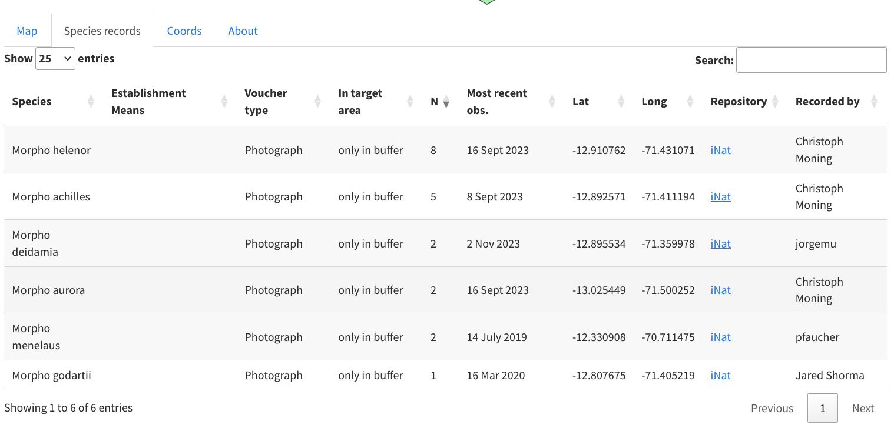
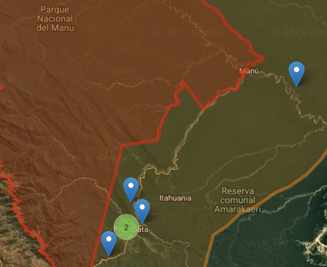

<!-- README.md is generated from README.Rmd. Please edit that file -->

# infinitylists 

<!-- badges: start -->

[](https://github.com/traitecoevo/infinitylists/actions/workflows/R-CMD-check.yaml)
[](https://doi.org/10.5281/zenodo.12677594)
[](https://lifecycle.r-lib.org/articles/stages.html#stable)
<!-- badges: end -->

`infinitylists` is a Shiny-based application that enables users to
extract species occurrence data from national and global databases to
generate species lists for any defined area. The area can be defined
either via a `kml` file or a circle for a specified latitude and
longitude, including the one for the current location of your device.

<p align="center">

</p>

The application retrieves records of species presence associated with:

- **Physical vouchers** (specimens stored in herbaria or museums across
  the world)
- **Photographic vouchers** (uploaded to iNaturalist)
- **Audio vouchers** (uploaded to iNaturalist)

This is designed for a field naturalist in, say Manu National Park,
Peru, who wants to know which species of Morpho butterflies have been
observed in or close by to the park.

The answer to this query is here in table form:

<p align="center">

</p>

and here in map form:

<p align="center">

</p>

For each species in the selected area, the app provides a field-friendly
formatting of: - Observation type - Number of observation - Date of the
most recent observation - Spatial coordinates - Voucher deposition
location - Observer

Most recent records are displayed in both a table and a map. All
observations in the selected area can be downloaded as a CSV file.

## Data Updates

The pre-loaded dataset is a download corresponding to the timestamp in
the releases section of GitHub. Users can also retrieve up-to-date data
using the code provided below.

## Record Display Rules

The map and table **only display the most recent record per species per
voucher type**. This means each species may be represented by up to two
records:

- **Physical voucher**
- **Photographic/audio voucher**

The total number of records is indicated in the text summary, while the
downloadable CSV contains **all records for the target area**, not just
the most recent ones. If you want all the observations in your area, not
just the most recent one for each species, use this button.

## Accessing the Web App

You can access the hosted version of `infinitylists` here:  
🔗 <https://unsw.shinyapps.io/infinitylists/>

## Local Installation

To install and run `infinitylists` locally from GitHub, use the
following commands:

``` r
# install.packages("remotes")

remotes::install_github("traitecoevo/infinitylists", build_vignettes = TRUE)

library(infinitylists)

infinitylistApp()
```

Running the application locally provides greater flexibility, allowing
you to load taxa-country combinations that may not be available in the
web app and retrieve data for any region worldwide.

## Adding New Taxa / Country Combinations

`infinitylists` includes several pre-loaded taxa-country combinations.
If you need to add a new taxon-country pair, follow these steps:

1.  Download data using the
    [`galah`](https://github.com/AtlasOfLivingAustralia/galah-R) R
    package, which interfaces with GBIF and ALA.
2.  Use the function `download_gbif_obs` to download the data and store
    it as a (fast to access) parquet file in a directory where
    `infinitylists` can access it.

``` r
# Example usage
# register with GBIF first before and include your information here
galah::galah_config(atlas = "Global",email = "youremail",password="yourpassword",username ="yourusername")

#check the size of your download first.  Some GBIF downloads may overwhelm your internet connection or storage capacity.  
# this checks the approximate size of reptile downloads from Madagascar. 
query_gbif_global("Reptilia",
                  min_year = 1980,
                  max_year = 2024,
                  country_code = "MG") |> 
  galah::atlas_counts()


download_gbif_obs(taxon = "Reptilia",country_code = "MG")

#restart the app locally:
infinitylistApp()
```

### Important Considerations

- The `taxon` argument must be a valid taxonomic group recognized by
  GBIF backbone.
- Small taxa-country combinations download quickly, but larger datasets
  may take longer and could cause connection timeouts.
- Ensure the geographic location is correctly specified so the data
  appears in the app.
- More frequently asked questions are on the About tab within the app
