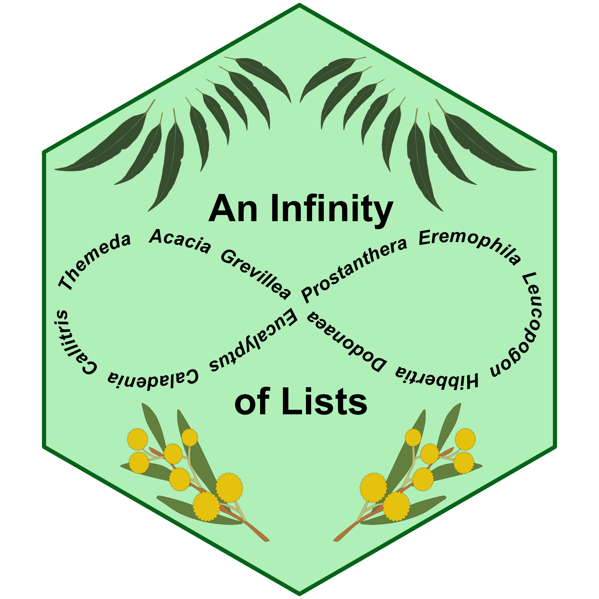

<!-- README.md is generated from README.Rmd. Please edit that file -->

# infinitylists 

<!-- badges: start -->

[](https://github.com/traitecoevo/infinitylists/actions/workflows/R-CMD-check.yaml)
[](https://app.codecov.io/gh/traitecoevo/infinitylists?branch=master)
<!-- badges: end -->

This shiny-based application allows users to extract plant occurrence
data from the Atlas of Living Australia (ALA) and generate a species
list for any defined area. All records associated with either a physical
voucher (stored in Australian herbaria or museum), a sound file, or a
photographic voucher (stored in iNaturalist) are extracted. For each
species within the defined area, the application will return voucher
type, number of vouchers, date of the most recent voucher, spatial
coordinates, voucher location, and the voucher collector. Records are
displayed both in a table and on a map, and are downloadable as a CSV.

## Use the app

The app can be accessed
here:<https://posit-connect-unsw.intersect.org.au/infinitylists/>

## Local Installation

You can install the development version of ‘infinitylists’ from
[GitHub](https://github.com/traitecoevo/infinitylists) with:

``` r
# install.packages("remotes")

remotes::install_github("traitecoevo/infinitylists")

library(infinitylists)

infinitylistApp()
```

## Adding new taxa

InfinityList comes with 5 taxa loaded to start with: plants,
butterflies, cicadas, marsupials, and dragonflies+damselflies. If you
want to add another taxon, you’ll need to download the data first via
the [galah interface](https://github.com/AtlasOfLivingAustralia/galah-R)
to the ALA. The function `download_ala_obs` will download the data and
put into a directory where infinitylistapp can find it. The value for
`taxon` needs to be a [valid taxonomic group as recognized by the
ALA](https://support.ala.org.au/support/solutions/articles/6000261677-taxonomy-a-species-filing-system).
The download step is fast for taxa with small number of observations in
ALA and slower for taxa with millions of observations.

``` r

# install.packages("galah")
library(infinitylists)

# register with ALA
galah::galah_config(email = "YOUR EMAIL HERE")

# download the data, this needs to be a valid taxa name
download_ala_obs(taxon = "Orthoptera")

infinitylistApp()
```
